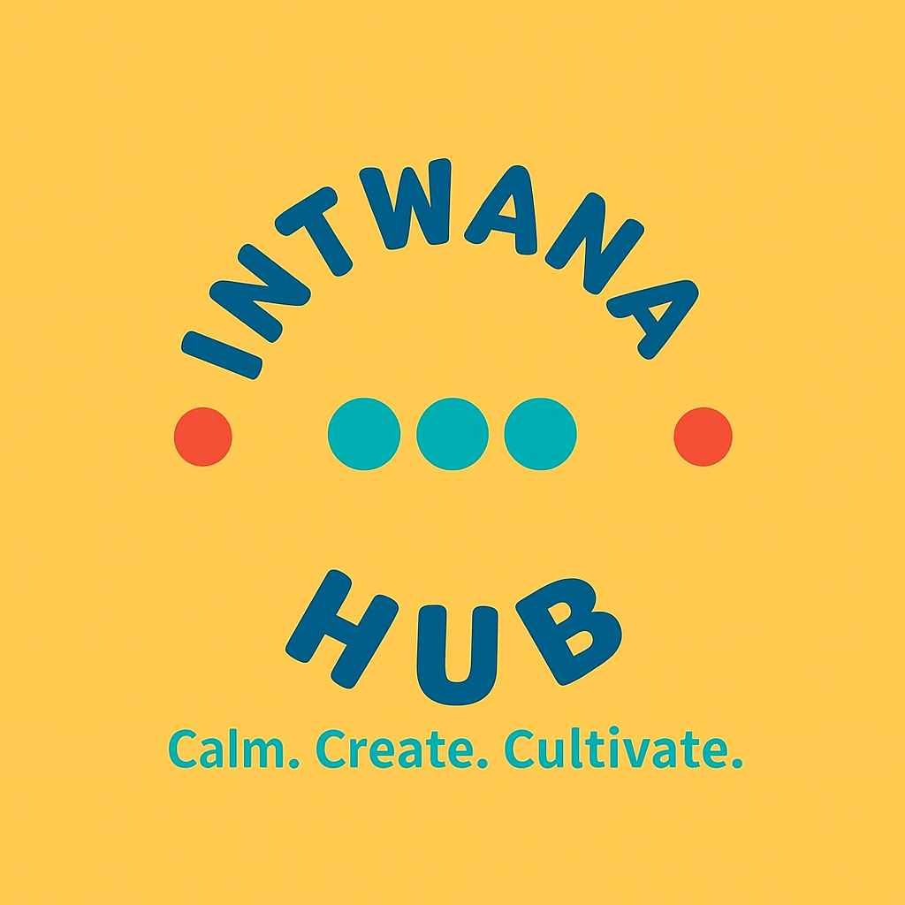

# 🌟 Intwana Hub



Intwana Hub is a **digital kasi community center** — a positive, chat-free platform designed to help young people **relax, create, and grow**.  
It combines **fun mini games, a creativity wall for showcasing art/music/code, a leaderboard with weekly challenges, and curated real-world opportunities**.  

This project was built for **Virtu-Hack 2025** 🚀  

---

## 🎯 Purpose
The Hub is focused on 3 vibes:
- 🧘 **Stress Relief** – play mini-games and enjoy positive quotes.  
- 🚀 **Empowerment** – discover curated gigs, resources, and learning opportunities.  
- 🎨 **Showcase Talent** – upload and share creations (art, music, code, poems) in a safe space.  

No chats, no negativity — just a space for kasi youth to shine.

---

## 🛠️ Features
- **Dashboard** with greetings, games, quotes, and opportunity highlights.  
- **Mini Games**: rock-paper-scissors, tic-tac-toe, memory match, hangman, quizzes, and more.  
- **Leaderboard** – gamified points system with weekly challenges.  
- **Creativity Wall** – upload art, music, code, poems; users can react with emojis ❤️🎉👍.  
- **Opportunities Board** – curated gigs and collabs (admin-approved).  
- **Profiles** (optional) – showcase skills, uploads, and scores.  

---

## 🚀 Tech Stack
- **Frontend**: Next.js (React + TailwindCSS)  
- **Backend**: Firebase (Auth, Firestore, Storage)  
- **Games**: Built with React components  
- **Hosting**: Vercel  

---

## 📦 Installation

1. Clone this repo:
   ```bash
   git clone https://github.com/okuhlecharlieman/Iyk-hub.git
   cd Iyk-hub
Install dependencies:

npm install


Add Firebase config:
Create a .env.local file and add:

NEXT_PUBLIC_FIREBASE_API_KEY=your_key
NEXT_PUBLIC_FIREBASE_AUTH_DOMAIN=your_project.firebaseapp.com
NEXT_PUBLIC_FIREBASE_PROJECT_ID=your_project_id
NEXT_PUBLIC_FIREBASE_STORAGE_BUCKET=your_project.appspot.com
NEXT_PUBLIC_FIREBASE_MESSAGING_SENDER_ID=your_sender_id
NEXT_PUBLIC_FIREBASE_APP_ID=your_app_id


Run locally:

npm run dev

🌍 Deployment

Deployed easily on Vercel:

vercel

📸 Screenshots
Dashboard

Creativity Wall

Opportunities Board

👥 Team

Okuhle Charlieman & contributors 💡

🏆 Hackathon Goal

Build a safe, creative hub for township youth — merging gaming, creativity, and opportunities into one uplifting platform.

📜 License

MIT License – free to use and adapt.


👉 You’ll just need to:  
1. Save your **logo** as `assets/logo.png`.  
2. Add some **screenshots** of your app (or mockups) into `assets/`.  
