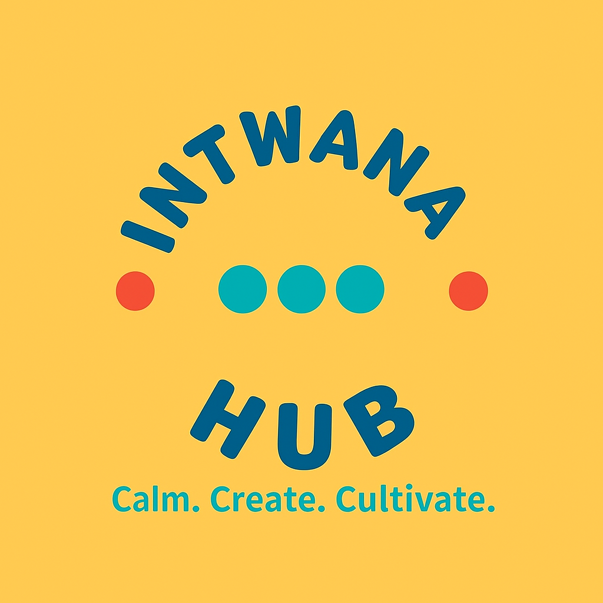
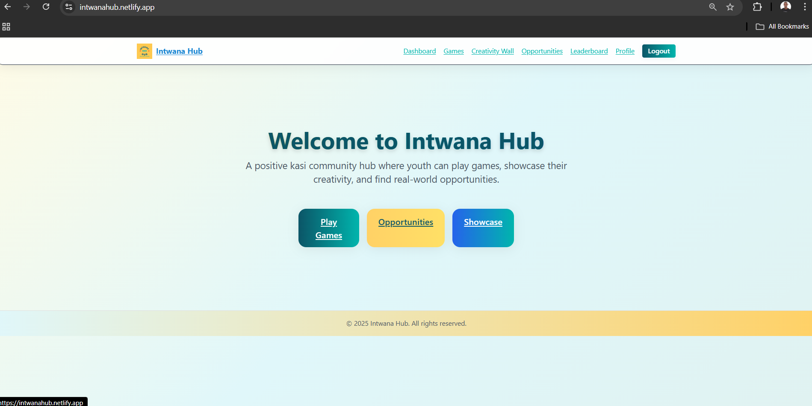
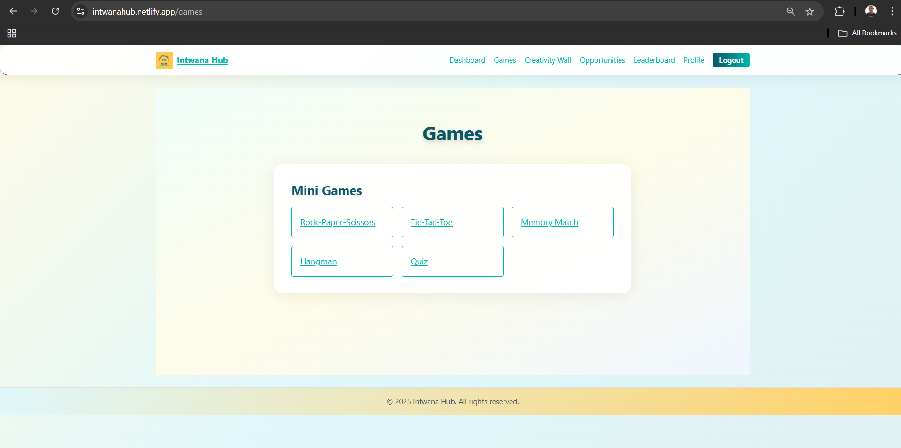
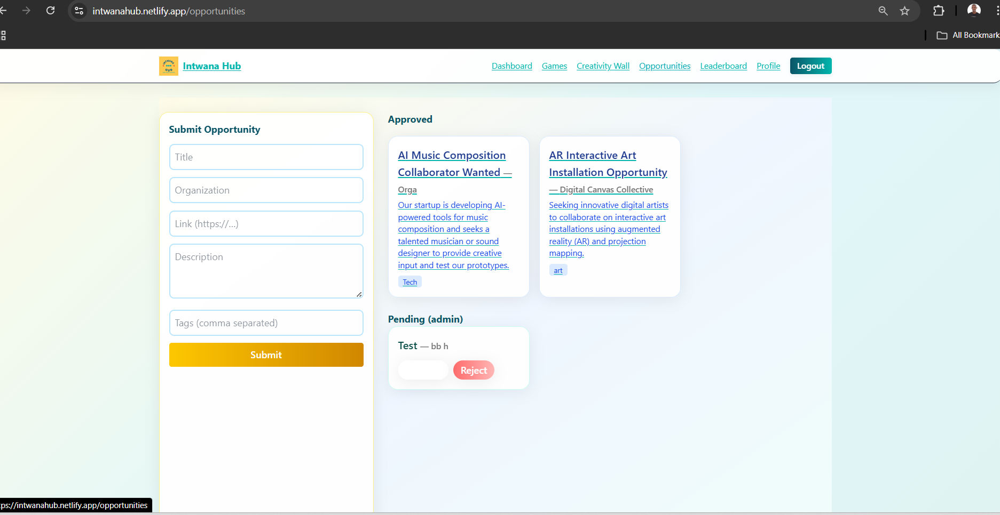
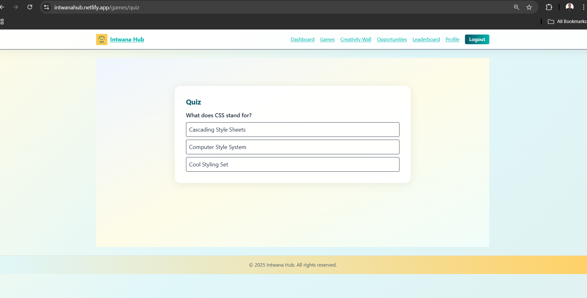
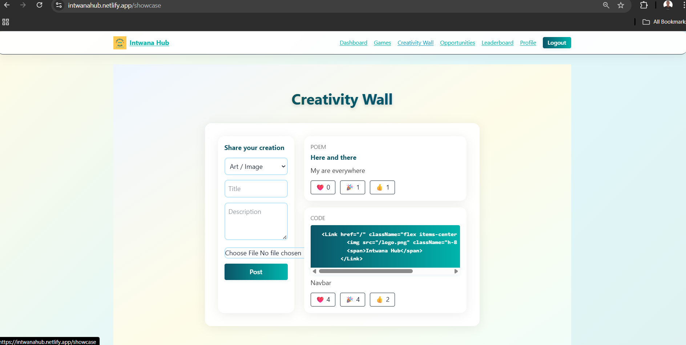
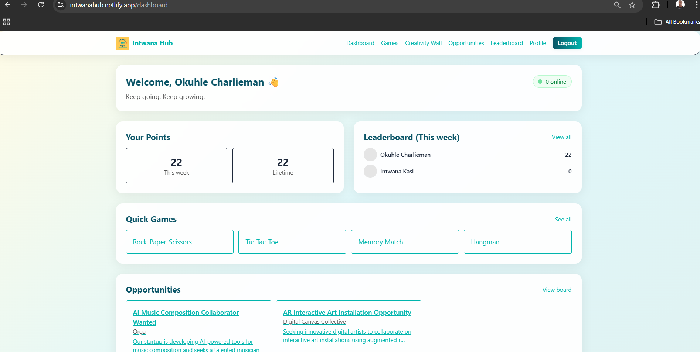

# 🌟 Intwana Hub



Intwana Hub is a **digital kasi community center** — a positive, chat-free platform designed to help young people **relax, create, and grow**.  
It combines **fun mini games, a creativity wall for showcasing art/music/code, a leaderboard with weekly challenges, and curated real-world opportunities**.  

This project was built for **Virtu-Hack 2025** 🚀  

---

## 🎯 Purpose
The Hub is focused on 3 vibes:
- 🧘 **Stress Relief** – play mini-games and enjoy positive quotes.  
- 🚀 **Empowerment** – discover curated gigs, resources, and learning opportunities.  
- 🎨 **Showcase Talent** – upload and share creations (art, music, code, poems) in a safe space.  

No chats, no negativity — just a space for kasi youth to shine.

---

## 🛠️ Features
- **Dashboard** with greetings, games, quotes, and opportunity highlights.  
- **Mini Games**: rock-paper-scissors, tic-tac-toe, memory match, hangman, quizzes, and more.  
- **Leaderboard** – gamified points system with weekly challenges.  
- **Creativity Wall** – upload art, music, code, poems; users can react with emojis ❤️🎉👍.  
- **Opportunities Board** – curated gigs and collabs (admin-approved).  
- **Profiles** (optional) – showcase skills, uploads, and scores.  

---

## 🚀 Tech Stack
- **Frontend**: Next.js (React + TailwindCSS)  
- **Backend**: Firebase (Auth, Firestore, Storage)  
- **Games**: Built with React components  
- **Hosting**: Vercel  

---

## 📦 Installation

1. Clone this repo:
   ```bash
   git clone https://github.com/okuhlecharlieman/Iyk-hub.git
   cd Iyk-hub
   ```
2. Install dependencies:
   ```bash
   npm install
   ```

3. Create a `.env.local` file in the root with your Firebase config:
   ```env
   NEXT_PUBLIC_FIREBASE_API_KEY=...
   NEXT_PUBLIC_FIREBASE_AUTH_DOMAIN=...
   NEXT_PUBLIC_FIREBASE_PROJECT_ID=...
   NEXT_PUBLIC_FIREBASE_STORAGE_BUCKET=...
   NEXT_PUBLIC_FIREBASE_MESSAGING_SENDER_ID=...
   NEXT_PUBLIC_FIREBASE_APP_ID=...
   NEXT_PUBLIC_FIREBASE_DATABASE_URL=https://YOUR_PROJECT_ID-default-rtdb.firebaseio.com
   ```

4. (For file uploads) Set Firebase Storage CORS:
   - Create a `cors.json` file:
     ```json
     [
       {
         "origin": ["http://localhost:3000","https://intwanahub.netlify.app","https://your-vercel-domain.vercel.app"],
         "method": ["GET","POST","PUT","HEAD"],
         "responseHeader": ["Authorization","Content-Type","x-goog-meta-*"] ,
         "maxAgeSeconds": 3600
       }
     ]
     ```
   - Run:
     ```bash
     gcloud auth login
     gcloud config set project YOUR_PROJECT_ID
     gsutil cors set cors.json gs://YOUR_BUCKET_NAME
     ```

4. Run locally:
   ```bash
   npm run dev
   ```

🌍 Deployment

Deployed easily on Vercel:

```bash
vercel
```

📸 Screenshots
Dashboard

Creativity Wall

Opportunities Board

👥 Team

Okuhle Charlieman & contributors 💡

🏆 Hackathon Goal

Build a safe, creative hub for township youth — merging gaming, creativity, and opportunities into one uplifting platform.

📜 License

MIT License – free to use and adapt.


## 📸 Screenshots and Images

### Logo


### Additional Assets
  
  
  
  
  
  


## Background Jobs

A weekly leaderboard reset cron is configured in `vercel.json` to call:

- `GET /api/jobs/weekly-leaderboard-reset` every Monday at 00:00 UTC.

Set `CRON_SECRET` in Vercel environment variables. The cron route requires:

- `Authorization: Bearer $CRON_SECRET`

The job resets `users.points.weekly` to `0` in batches and records metadata in `systemJobs/weeklyLeaderboardReset`.

A creator-boost lifecycle cron is also configured:

- `GET /api/jobs/creator-boost-lifecycle` every 6 hours to auto-activate paid pending boosts and expire overdue active boosts.

This job processes records in batches and records metadata in `systemJobs/creatorBoostLifecycle`.
