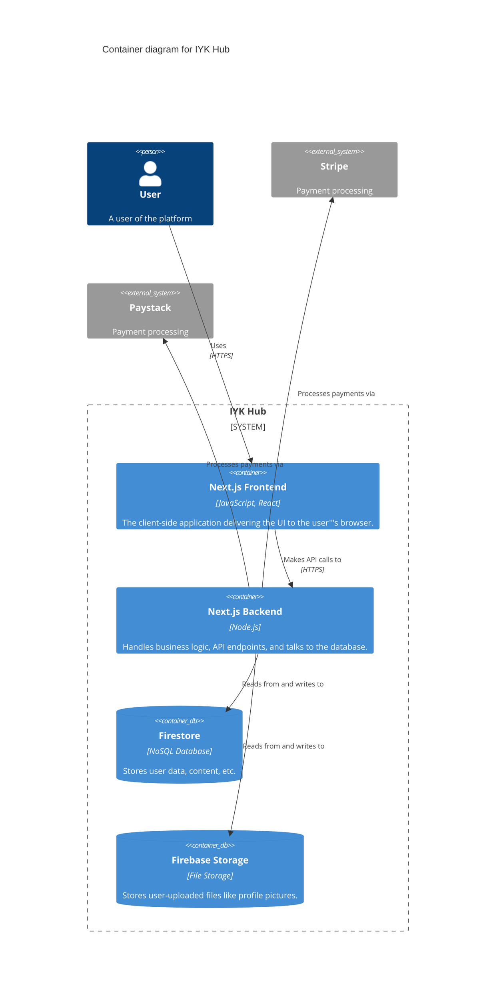
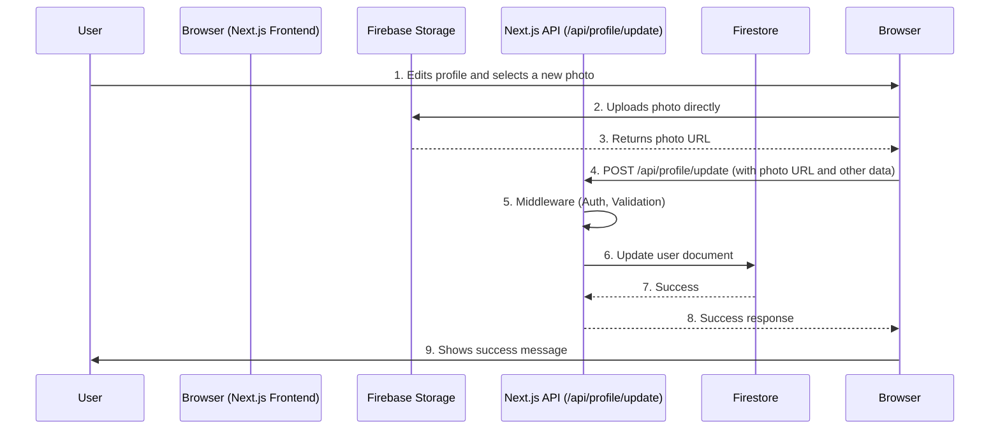

# Architecture Overview

This document provides an overview of the IYK Hub application architecture, including the main components and data flows.

## High-Level Architecture

The IYK Hub is a modern web application built on a serverless architecture, leveraging Next.js for both the frontend and backend, and Firebase for backend services.

The following diagram illustrates the main containers of the application:

## Data Flows

To illustrate how data flows through the system, let'''s consider the use case of a user updating their profile.

### Profile Update Sequence Diagram

The following diagram shows the sequence of events when a user updates their profile information, including their profile picture.

This data flow is representative of how many features in the application work:

1.  The client-side application (Next.js Frontend) interacts with the user.
2.  For file uploads, the client communicates directly with Firebase Storage to leverage its scalability and security features.
3.  The client then calls the application'''s backend (Next.js API) with the relevant data.
4.  The backend enforces business logic, such as authentication and validation, and then updates the application'''s state in the Firestore database.
